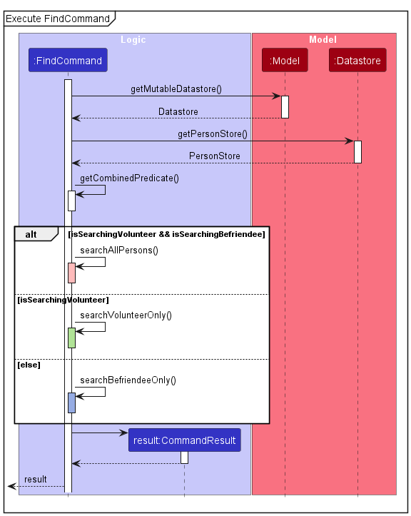
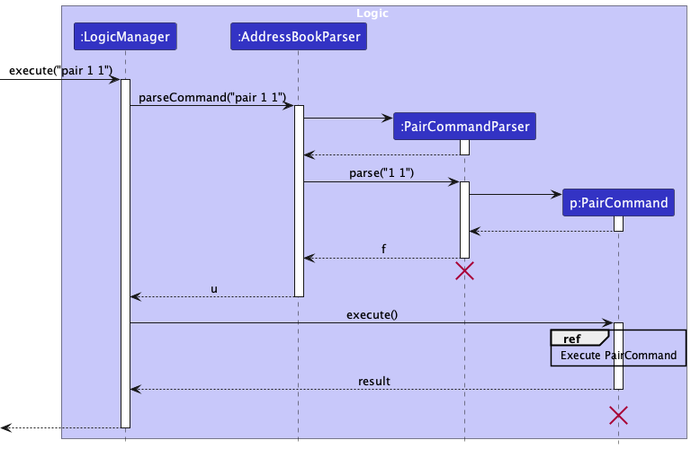
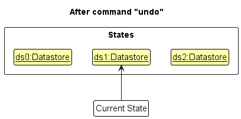
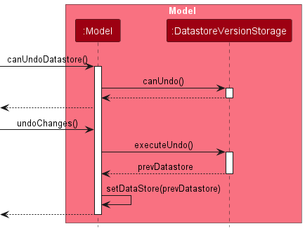
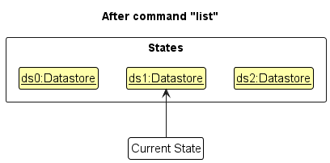

* Table of Contents
{:toc}

--------------------------------------------------------------------------------------------------------------------

## **Acknowledgements**

* {list here sources of all reused/adapted ideas, code, documentation, and third-party libraries -- include links to the original source as well}

--------------------------------------------------------------------------------------------------------------------

## **Setting up, getting started**

Refer to the guide [_Setting up and getting started_](SettingUp.md).

--------------------------------------------------------------------------------------------------------------------

## **Design**

:bulb: **Tip:** The `.puml` files used to create diagrams in this document `docs/diagrams` folder. Refer to the [_PlantUML Tutorial_ at se-edu/guides](https://se-education.org/guides/tutorials/plantUml.html) to learn how to create and edit diagrams.

### Architecture

The ***Architecture Diagram*** given above explains the high-level design of the App.

Given below is a quick overview of main components and how they interact with each other.

**Main components of the architecture**

**`Main`** (consisting of classes [`Main`](https://github.com/se-edu/addressbook-level3/tree/master/src/main/java/seedu/address/Main.java) and [`MainApp`](https://github.com/se-edu/addressbook-level3/tree/master/src/main/java/seedu/address/MainApp.java)) is in charge of the app launch and shut down.
* At app launch, it initializes the other components in the correct sequence, and connects them up with each other.
* At shut down, it shuts down the other components and invokes cleanup methods where necessary.

The bulk of the app's work is done by the following four components:

* [**`UI`**](#ui-component): The UI of the App.
* [**`Logic`**](#logic-component): The command executor.
* [**`Model`**](#model-component): Holds the data of the App in memory.
* [**`Storage`**](#storage-component): Reads data from, and writes data to, the hard disk.

[**`Commons`**](#common-classes) represents a collection of classes used by multiple other components.

**How the architecture components interact with each other**

The *Sequence Diagram* below shows how the components interact with each other for the scenario where the user issues the command `delete 1`.

Each of the four main components (also shown in the diagram above),

* defines its *API* in an `interface` with the same name as the Component.
* implements its functionality using a concrete `{Component Name}Manager` class (which follows the corresponding API `interface` mentioned in the previous point.

For example, the `Logic` component defines its API in the `Logic.java` interface and implements its functionality using the `LogicManager.java` class which follows the `Logic` interface. Other components interact with a given component through its interface rather than the concrete class (reason: to prevent outside component's being coupled to the implementation of a component), as illustrated in the (partial) class diagram below.

The sections below give more details of each component.

### UI component

The **API** of this component is specified in [`Ui.java`](https://github.com/se-edu/addressbook-level3/tree/master/src/main/java/seedu/address/ui/Ui.java)

The UI consists of a `MainWindow` that is made up of parts e.g.`CommandBox`, `ResultDisplay`, `PersonListPanel`, `StatusBarFooter` etc. All these, including the `MainWindow`, inherit from the abstract `UiPart` class which captures the commonalities between classes that represent parts of the visible GUI.

The `UI` component uses the JavaFx UI framework. The layout of these UI parts are defined in matching `.fxml` files that are in the `src/main/resources/view` folder. For example, the layout of the [`MainWindow`](https://github.com/se-edu/addressbook-level3/tree/master/src/main/java/seedu/address/ui/MainWindow.java) is specified in [`MainWindow.fxml`](https://github.com/se-edu/addressbook-level3/tree/master/src/main/resources/view/MainWindow.fxml)

The `UI` component,

* executes user commands using the `Logic` component.
* listens for changes to `Model` data so that the UI can be updated with the modified data.
* keeps a reference to the `Logic` component, because the `UI` relies on the `Logic` to execute commands.
* depends on some classes in the `Model` component, as it displays `Person` object residing in the `Model`.

### Logic component

**API** : [`Logic.java`](https://github.com/se-edu/addressbook-level3/tree/master/src/main/java/seedu/address/logic/Logic.java)

Here's a (partial) class diagram of the `Logic` component:

The sequence diagram below illustrates the interactions within the `Logic` component, taking `execute("delete 1")` API call as an example.

:information_source: **Note:** The lifeline for `DeleteCommandParser` should end at the destroy marker (X) but due to a limitation of PlantUML, the lifeline continues till the end of diagram.

How the `Logic` component works:

1. When `Logic` is called upon to execute a command, it is passed to an `AddressBookParser` object which in turn creates a parser that matches the command (e.g., `DeleteCommandParser`) and uses it to parse the command.
1. This results in a `Command` object (more precisely, an object of one of its subclasses e.g., `DeleteCommand`) which is executed by the `LogicManager`.
1. The command can communicate with the `Model` when it is executed (e.g. to delete a person). 
   Note that although this is shown as a single step in the diagram above (for simplicity), in the code it can take several interactions (between the command object and the `Model`) to achieve.
1. The result of the command execution is encapsulated as a `CommandResult` object which is returned back from `Logic`.

Here are the other classes in `Logic` (omitted from the class diagram above) that are used for parsing a user command:

How the parsing works:
* When called upon to parse a user command, the `AddressBookParser` class creates an `XYZCommandParser` (`XYZ` is a placeholder for the specific command name e.g., `AddCommandParser`) which uses the other classes shown above to parse the user command and create a `XYZCommand` object (e.g., `AddCommand`) which the `AddressBookParser` returns back as a `Command` object.
* All `XYZCommandParser` classes (e.g., `AddCommandParser`, `DeleteCommandParser`, ...) inherit from the `Parser` interface so that they can be treated similarly where possible e.g, during testing.

### Model component
**API** : [`Model.java`](https://github.com/AY2324S2-CS2103T-T09-3/tp/src/main/java/scrolls/elder/model/Model.java)

The `Model` component,

* stores all in-memory application data (i.e., `Datastore` and `UserPref` objects)
* stores a `UserPref` object that represents the user’s preferences. This is exposed to the outside as a `ReadOnlyUserPref` objects.
* stores a `Datastore` object that represents the functional data in an application. This is exposed to the outside as a `ReadOnlyDatastore` object.
* does not depend on any of the other three components (as the `Model` represents data entities of the domain, they should make sense on their own without depending on other components)

#### Datastore

Contains the `PersonStore`:

* stores the currently 'selected' `Person` objects (e.g., results of a search query) as a separate _filtered_ list which is exposed to outsiders as an unmodifiable `ObservableList<Person>` that can be 'observed' e.g. the UI can be bound to this list so that the UI automatically updates when the data in the list change.
  
Contains the `LogStore`:

* stores the currently 'selected' `Log` objects (e.g., results of a search query) as a separate _filtered_ list which is exposed to outsiders as an unmodifiable `ObservableList<Log>` that can be 'observed' e.g. the UI can be bound to this list so that the UI automatically updates when the data in the list change.

:information_source: **Note:** An alternative (arguably, a more OOP) model is given below. It has a `Tag` list in the `AddressBook`, which `Person` references. This allows `AddressBook` to only require one `Tag` object per unique tag, instead of each `Person` needing their own `Tag` objects. 

### Storage component

**API** : [`Storage.java`](https://github.com/AY2324S2-CS2103T-T09-3/tp/master/src/main/java/scrolls/elder/storage/Storage.java)

The `Storage` component,
* can save both application data and user preference data in JSON format, and read them back into corresponding objects.
* inherits from both `DatastoreStorage` and `UserPrefStorage`, which means it can be treated as either one (if only the functionality of only one is needed).
* depends on some classes in the `Model` component (because the `Storage` component's job is to save/retrieve objects that belong to the `Model`)

### Common classes

Classes used by multiple components are in the `scrolls.elder.commons` package.

--------------------------------------------------------------------------------------------------------------------

## **Implementation**

This section describes some noteworthy details on how certain features are implemented.

### Find feature

#### Implementation

##### `FindCommandParser` Class
The `FindCommandParser` class is responsible for parsing user input and creating a corresponding `FindCommand` object for execution. The implementation involves several key steps:
* **Role Parsing**: The parser first identifies the roles specified in the user input, such as "volunteer" or "befriendee", using predefined flags (`SEARCH_VOLUNTEER_FLAG` and `SEARCH_BEFRIENDEE_FLAG`).
It determines whether the search should be restricted to a specific role, both roles, or neither.
* **Pair Flag Parsing**: Next, the parser extracts any flags indicating whether the search should include paired or unpaired individuals.
It determines whether the search should include paired individuals, unpaired individuals, both, or neither.
* **Tag Parsing**: The parser then parses any tags specified in the user input, which are prefixed with a tag indicator (`t/`). Tags are extracted and used to create a `TagListContainsTagsPredicate` object for filtering.
* **Name Parsing**: After extracting roles, pair flags, and tags, the parser processes the remaining input as potential name keywords for filtering.
It constructs a `NameContainsKeywordsPredicate` object to filter individuals based on their names.
* **Search Criteria Combination**: The parser combines the parsed search criteria (roles, pair flags, tags, and name keywords) into a single `FindCommand` object.
* **Handling Search Exceptions**: The parser checks for any invalid command formats or missing input parameters and throws a `ParseException` if necessary.
* **Return `FindCommand` Object**: Finally, the parser returns the constructed `FindCommand` object, encapsulating the parsed search criteria, for further execution.

##### `FindCommand` Class
The find command finds all persons whose names contain any of the given keywords, supports searches in separate Volunteer and Befriendee lists, search by tags, and by pairing status. The `FindCommand` class is responsible for executing the find operation based on parsed user input.

* **Command Execution:** The `execute()` method overrides the parent class Command method to perform the actual find operation.
It retrieves the PersonStore from the model to access the list of persons.
* **Search Criteria:** The class contains boolean flags (`isSearchingVolunteer`, `isSearchingBefriendee`) to determine whether to search volunteers, befriendees, or both.
Similar flags (`isSearchingPaired`, `isSearchingUnpaired`) are used to filter persons based on their pairing status.
* **Search Methods:*** `searchAllPersons()`, `searchVolunteerOnly()`, and `searchBefriendeeOnly()` methods are used to perform searches based on the specified criteria.
These methods update the filtered person list in the PersonStore based on the search predicates.
* **Result Handling:** The search results are wrapped in a `CommandResult` object, which contains a message indicating the number of persons found.
The message is formatted using the Messages class constants.
* **Error Handling:** The class throws a CommandException if the search operation fails due to an invalid search predicate or an empty search result.
* **Equality Check:** The `equals()` method is overridden to compare two `FindCommand` objects based on their search predicates and flags.

The following sequence diagram shows how a Find operation goes through the `Logic` component:

#### Design Considerations

##### **Aspect: Tag Parsing in FindCommandParser:**

* **Alternative 1: (Current Choice):** Parsing tags separately from other search criteria.
  * Pros: Allows users to specify additional search criteria based on tags.
  * Cons: Requires additional parsing logic and potentially increases complexity in handling multiple search parameters.

* **Alternative 2:** Incorporating tags into the main search query without separate parsing.
  * Pros: Simplifies parsing logic by integrating tags directly into the search query.
  * Cons: May limit flexibility in specifying tag-based search criteria or require more sophisticated parsing algorithms.

##### **Aspect: Handling Search Criteria in FindCommand:**

* **Alternative 1 (Current Choice)**: Implementing separate predicates for name and tag search criteria.
  * Pros: Offers flexibility in defining and combining different search parameters.
  * Cons: May lead to redundant filtering or increased complexity in managing multiple predicates.

* **Alternative 2**: Consolidating search criteria into a single unified predicate.
  * Pros: Simplifies filtering logic by reducing the number of separate predicates.
    * Cons: May limit the flexibility to apply different search parameters independently or require more complex predicate structures.

### Pair feature

#### Implementation

The pair mechanism is facilitated by updating the `pairedWithName` and `pairedWithId` fields of the `Person` object. Two paired `Person`s will have their `pairedWithName` and `pairedWithId` fields updated to reflect the `name` and `personId` of the `Person` they are paired with.

The `name` is saved to facilitate easy identification of the paired `Person` when displaying the `Person` object. The `personId` is saved to facilitate easy retrieval of the paired `Person` object when needed.

The `PairCommand` class is responsible for pairing two persons, and the `UnpairCommand` class is responsible for unpairing two persons. The `PairCommand` and `UnpairCommand` classes are executed by the `Logic` component.

The following sequence diagram shows how an undo operation goes through the `Logic` component:

#### Design considerations:

**Aspect: What attribute(s) should be saved in the `Person` object:**

* **Alternative 1 (current choice):** Save the `name` and `personId` of the paired `Person`.
    * Pros: Might need extra steps to search for the paired `Person` as only the `name` and `personId` are saved.
    * Cons: Uses less memory.

* **Alternative 2:** Save the paired `Person` within the `Person` object.
  itself.
    * Pros: Easy to access and manipulate the paired `Person`.
    * Cons: Uses more memory and includes redundant information.

### Add Log feature

#### Implementation

The Add Log feature allows users to add a new log entry to the application.

The `LogAddCommand` class is responsible for creating a new log entry, and the `LogAddCommandParser` class is responsible for parsing the user input to create a `LogAddCommand` object.

The `LogAddCommand` class is executed by the `Logic` component.

#### Design Considerations

**Aspect: Whether to use unique `logId` for each `Log` object:**

* **Alternative 1 (current choice):** The `logId` is automatically generated for each `Log` object, ensuring that each log entry has a unique identifier.
    * Pros: Ensures that each log entry is uniquely identified.
    * Cons: Adds complexity to the implementation of the `LogStore` (e.g., maintaining a `logIdSequence` to generate unique `logId` values)

* **Alternative 2:** The `logId` is not used, and the `Log` object is identified by its position in the list of logs.
    * Pros: Simplifies the process of adding a log entry.
    * Cons: May lead to confusion if log entries are deleted or reordered.

Here's an example of how you can use the Add Log feature:

1. To add a log entry, use the `addlog` command followed by the `volunteerId`, `befriendeeId`, `startdate`, `duration` and `remarks`. For example, `addlog v/1 b/2 s/2022-03-01-10:00 d/2 r/Visited Mr. Tan`.

2. The application will create a new log entry with the provided details and add it to the list of logs.

3. If the command is successful, the application will display a message indicating that the log entry has been added.

Please note that the `volunteerId` and `befriendeeId` must correspond to existing volunteers and befriendees in the application. The `startdate` should be in the format `YYYY-MM-DD` and the `duration` should be the number of hours the visit lasted. The `remarks` field is optional and can be used to add any additional notes about the visit.

### Edit log feature

#### Implementation

The edit log feature allows user to modify the details of an existing log entry in the address book. The index of the log entry has to be edited is specified by the user in order to execute the `LogEditCommand`.

The `LogEditCommand` class is responsible for editing the details of a log entry,
and the `LogEditCommandParser` class is responsible for parsing the user input to create a `LogEditCommand` object.

The `LogEditCommand` class is executed by the `Logic` component.

#### Design Considerations

**Aspect: What attribute(s) can be edited in the `Log` object:**

* **Alternative 1 (current choice):** The `volunteerId`, `befriendeeId`, `startdate`, `duration` and `remarks` of the
    `Log` can be edited.
    * Pros: Provides flexibility for users to update various attributes of a log entry.
    * Cons: Accidental edits when editing contact ids in `Log` may lead to cascading effects in other 
      attributes displayed, such as timeServed in volunteer contacts.
* **Alternative 2:** The `startdate`, `duration` and `remarks` of the `Log` can be edited, 
    while the `volunteerId`, `befriendeeId` is kept immutable.
    * Pros: Prevents cascading modifications of attributes displayed in `Person` contact.
    * Cons: Restricts the flexibility of the `LogEdit` feature

### Undo/redo feature

#### Implementation

The undo/redo mechanism is facilitated by `DatastoreVersionStorage`. It is a data structure storing the undo/redo history of the datastores stored in the model, stored internally as an `datastoreVersions` and `currentStatePointer`. Additionally, it implements the following operations:

* `DatastoreVersionStorage#commitDatastore()` — Saves the current datastore state in its history.
* `DatastoreVersionStorage#executeUndo()` — Returns the previous address book state from its history, for the model to reset the datastore
* `DatastoreVersionStorage#executeRedo()` — Returns a previously undone address book state from its history, for the model to reset the datastore

`DatastoreVersionStorage#commitDatastore()` is exposed in the `Model` interface as `Model#commitDatastore()` while `Model#undoChanges()` and `Model#redoChanges()` call `DatastoreVersionStorage#executeUndo()` and `DatastoreVersionStorage#executeRedo()` respectively to carry out the undo and redo actions.

Given below is an example usage scenario and how the undo/redo mechanism behaves at each step.

Step 1. The user launches the application for the first time. The `DatastoreVersionStorage` will be initialized with the initial datastore state, and the `currentStatePointer` pointing to that single datastore state.

Step 2. The user executes `delete 5 r/volunteer` command to delete the 5th volunteer in the datastore. The `delete` command calls `Model#commitDatastore()`, causing the modified state of the datastore after the `delete 5 r/volunteer` command executes to be saved in the `datastoreVersions`, and the `currentStatePointer` is shifted to the newly inserted datastore state.

Step 3. The user executes `add n/David …​` to add a new person. The `add` command also calls `Model#commitDatastore()`, causing another modified datastore state to be saved into the `datastoreVersions`.

:information_source: **Note:** If a command fails its execution, it will not call `Model#commitDatastore()`, so the datastore state will not be saved into the `datastoreVersions`.

Step 4. The user now decides that adding the person was a mistake, and decides to undo that action by executing the `undo` command.
The `undo` command will call `Model#undoChanges()`, which will shift the `currentStatePointer` once to the left, pointing it to the previous datastore state, and restores the datastore to that state.

:information_source: **Note:** If the `currentStatePointer` is at index 0, pointing to the initial Datastore state, then there are no previous Datastore states to restore. The `undo` command uses `Model#canUndoDatastore()` to check if this is the case. If so, it will return an error to the user rather
than attempting to perform the undo.

The following sequence diagram shows how an undo operation goes through the `Logic` component:

:information_source: **Note:** The lifeline for `UndoCommand` should end at the destroy marker (X) but due to a limitation of PlantUML, the lifeline reaches the end of diagram.

Similarly, how an undo operation goes through the `Model` component is shown below:

The `redo` command does the opposite — it calls `Model#redoChanges()`, which shifts the `currentStatePointer` once to the right, pointing to the previously undone state, and restores the datastore to that state.

:information_source: **Note:** If the `currentStatePointer` is at index `datastoreVersions.size() - 1`, pointing to the latest datastore state, then there are no undone Datastore states to restore. The `redo` command uses `Model#canRedoDatastore()` to check if this is the case. If so, it will return an error to the user rather than attempting to perform the redo.

Step 5. The user then decides to execute the command `list`. Commands that do not modify the datastore, such as `list`, will usually not call `Model#commitDatastore()`, `Model#undoChanges()` or `Model#redoChanges()`. Thus, the `datastoreVersions` remains unchanged.

Step 6. The user executes `clear`, which calls `Model#commitDatastore()`. Since the `currentStatePointer` is not pointing at the end of the `datastoreVersions`, all address book states after the `currentStatePointer` will be purged. Reason: It no longer makes sense to redo the `add n/David …​` command. This is the behavior that most modern desktop applications follow.

The following activity diagram summarizes what happens when a user executes a new command:

#### Design considerations:

**Aspect: How undo & redo executes:**

* **Alternative 1 (current choice):** Saves the entire address book.
  * Pros: Easy to implement.
  * Cons: May have performance issues in terms of memory usage.

* **Alternative 2:** Individual command knows how to undo/redo by
  itself.
  * Pros: Will use less memory (e.g. for `delete`, just save the person being deleted).
  * Cons: We must ensure that the implementation of each individual command are correct.

_{more aspects and alternatives to be added}_

### \[Proposed\] Data archiving

_{Explain here how the data archiving feature will be implemented}_

--------------------------------------------------------------------------------------------------------------------

## **Documentation, logging, testing, configuration, dev-ops**

* [Documentation guide](Documentation.md)
* [Testing guide](Testing.md)
* [Logging guide](Logging.md)
* [Configuration guide](Configuration.md)
* [DevOps guide](DevOps.md)

--------------------------------------------------------------------------------------------------------------------

## **Appendix: Requirements**

### Product scope

**Target user profile**:

* is a manager of a befriending volunteer organisation
* has a need to keep track of many befriendees/elderly of the volunteer programme
* has a need to keep track of volunteers in the organisation
* prefer desktop apps over other types
* can type fast
* prefers typing to mouse interactions
* is reasonably comfortable using CLI apps

**Value proposition**: manage the volunteer organisation faster than a typical mouse/GUI driven app

### User stories

Priorities: High (must have) - `* * *`, Medium (nice to have) - `* *`, Low (unlikely to have) - `*`

| Priority | As a …​   | I want to …​                                                                           | So that I can…​                                               |
|-----|-----------|----------------------------------------------------------------------------------------|---------------------------------------------------------------|
| `* * *` | manager   | add volunteers’ and elderly befriendees’ contacts                                      |                                                               |
| `* * *` | manager   | edit volunteers’ and elderly befriendees’ details                                      |                                                               |
| `* * *` | manager   | delete volunteer and elderly befriendee contacts                                       |                                                               |
| `* * *` | manager   | view list of volunteers and elderly befriendees                                        | keep track of the roster                                      |
| `* * *` | manager   | tag elderly befriendees with relevant details                                          | accommodate for any special circumstances                     |
| `* * *` | manager   | pair volunteers with befriendee contacts                                               | assign the pairings                                           |
| `* * *` | manager   | view details of elderly befriendee                                                     | know the address and case details                             |
| `* * *` | manager   | view details of volunteer befriender                                                   | know the details of the volunteer                             |
| `* *` | first-time user   | access a help page                                                                     | refer to the features that come along with the application    |
| `* *` | manager   | have a one-stop view of all the important information about the elderly and volunteers | contact each person easily                                    |
| `* *` | manager   | see a timetable with meeting details                                                   | quickly see the planned meeting sessions                      |
| `* *` | manager   | search for specific contact based on keywords                                          | quickly see contact details of specific people                |
| `* *` | manager   | add details directly to pairings                                                       | add information specific to pairings                          |
| `* *` | manager   | search for specific contact based on keywords                                          | quickly see contact details of specific people                |
| `*` | first-time user   | see sample befriendee and volunteer profiles                                           | try out the features with pre-loaded data                     |
| `*` | first-time user   | follow a guided tour                                                                   | be aware of how to use and access features in the application |

*{More to be added}*

### Use cases

(For all use cases below, the **System** is the `Elder Scrolls` and the **Actor** is the
`volunteer organisation manager`, unless specified otherwise)

**Use case: UC01 - Add a contact**

**MSS**

1. User requests to add contact, entering contact information
2. Elder Scrolls adds the contact
3. Elder Scrolls displays the details of the contact added

    Use case ends.

**Extensions**

* 2a. The given contact details are invalid.

  * 2a1. Elder Scrolls shows an error message.

    Use case ends.

* 3a. The given contact details are already in the contact book

    * 3a1. Elder scrolls shows an error message.

     Use case ends.

**Use case: UC02 - Delete a contact**

**MSS**

1.  User requests to list all contacts
2.  Elder Scrolls shows a list of all contacts
3.  User requests to delete a specific contact using its unique ID (UID)
4.  Elder Scrolls deletes the contact based on its UID

    Use case ends.

**Extensions**

* 2a. The list is empty.

  * 2a1. Elder Scrolls shows an error message.

    Use case ends.

* 3a. The given UID is invalid.

    * 3a1. Elder Scrolls shows an error message.

      Use case resumes at step 2.

* 4a. The contact requested to be deleted is still paired.

  * 4a1. Elder Scrolls shows an error message.

    Use case resumes at step 2.

**Use case: UC03 - List all contacts**

**MSS**

1. User requests to list all contacts
2. Elder Scrolls shows a list of all contacts

   Use case ends.

**Extensions**

* 2a. The list is empty.

    * 2a1. Elder Scrolls shows an error message.

      Use case ends.

**Use case: UC04 - List all volunteer contacts**

**MSS**

1. User requests to list all volunteer contacts
2. Elder Scrolls shows a list of all volunteer contacts

   Use case ends.

**Extensions**

* 2a. The list is empty.

    * 2a1. Elder Scrolls shows an error message.

      Use case ends.

* 3a. The incorrect filtering parameter used, ie. 'vol' not used

  * 3a1. Elder Scrolls shows an error message.

    Use case ends.

**Use case: UC05 - List all befriendee contacts**

**MSS**

1. User requests to list all befriendee contacts
2. Elder Scrolls shows a list of all befriendee contacts

   Use case ends.

**Extensions**

* 2a. The list is empty.

    * 2a1. Elder Scrolls shows an error message.

      Use case ends.

* 3a. The incorrect filtering parameter used, ie. 'bef' is not used

    * 3a1. Elder Scrolls shows an error message.

      Use case ends.

**Use case: UC06 - Pair a volunteer and befriendee**

**MSS**

1.  User <u>requests to list all contacts (UC03)</u>.
2.  Elder Scrolls shows a list of contacts.
3.  User requests to pair a specific volunteer and befriendee in the list.
4.  Elder Scrolls pairs the specified volunteer and befriendee.

    Use case ends.

**Extensions**

* 3a. The given UID is invalid.

    * 3a1. Elder Scrolls shows an error message indicating that the given UID is invalid.

      Use case resumes at step 2.

* 3b. The given UIDs are both volunteers or both befriendees.

    * 3b1. Elder Scrolls shows an error message indicating that the given UIDs are not of different types.

      Use case resumes at step 2.

* 3b. One or both given UIDs are already paired.

    * 3b1. Elder Scrolls shows an error message indicating that the given UID(s) are already paired.

      Use case resumes at step 2.

**Use case: UC07 - Tag contacts**

**MSS**

1.  User <u>requests to list all contacts (UC03)</u>.
2.  Elder Scrolls shows a list of contacts.
3.  User requests to tag a specific person with a property.
4.  Elder Scrolls tags the specified person in the list with that specified property.

    Use case ends.

**Extensions**

* 3a. The given UID is invalid.

    * 3a1. Elder Scrolls shows an error message.

      Use case resumes at step 2.

*{More to be added}*
### Non-Functional Requirements

1. Should work on any _mainstream OS_ as long as it has Java `11` or above installed.
2. Should be able to hold up to 1000 persons without a noticeable sluggishness in performance for typical usage.
3. A user with above average typing speed for regular English text (i.e. not code, not system admin commands) should be able to accomplish most of the tasks faster using commands than using the mouse.
4. Should have a simple menu structure with clear labels, guiding users to key actions without extensive tutorials.
5. Should have graceful error handling with clear human-readable messages to the user to guide them in fixing their command.
6. Ability to filter contacts based on relevant criteria (location, demographics, skills, availability) to aid in pairing.
7. Should have a robust data storage mechanism that can handle data corruption and large data sets.

### Glossary

* **Befriendee**: Elderly person seeking companionship
* **Befriending Volunteer Organisations**: An organisation that aims to provide companionship to seniors by pairing them with volunteers
* **Pairing**: Assigning of a volunteer to a befriendee and a befriendee to a volunteer (one-to-one)) so that they become a pair
* **Tagging**: Adding an arbitrary detail(s) to a volunteer or befriendee profile to aid in identifying special conditions

--------------------------------------------------------------------------------------------------------------------

## **Appendix: Instructions for manual testing**

Given below are instructions to test the app manually.

:information_source: **Note:** These instructions only provide a starting point for testers to work on;
testers are expected to do more *exploratory* testing.

### Launch and shutdown

1. Initial launch

   1. Download the jar file and copy into an empty folder

   1. Double-click the jar file Expected: Shows the GUI with a set of sample contacts. The window size may not be optimum.

1. Saving window preferences

   1. Resize the window to an optimum size. Move the window to a different location. Close the window.

   1. Re-launch the app by double-clicking the jar file. 
       Expected: The most recent window size and location is retained.

1. _{ more test cases …​ }_

### Deleting a person

1. Deleting a person while all persons are being shown

   1. Prerequisites: List all persons using the `list` command. Multiple persons in the list.

   1. Test case: `delete 1` 
      Expected: First contact is deleted from the list. Details of the deleted contact shown in the status message. Timestamp in the status bar is updated.

   1. Test case: `delete 0` 
      Expected: No person is deleted. Error details shown in the status message. Status bar remains the same.

   1. Other incorrect delete commands to try: `delete`, `delete x`, `...` (where x is larger than the list size) 
      Expected: Similar to previous.

1. _{ more test cases …​ }_

### Saving data

1. Dealing with missing/corrupted data files

   1. _{explain how to simulate a missing/corrupted file, and the expected behavior}_

1. _{ more test cases …​ }_
